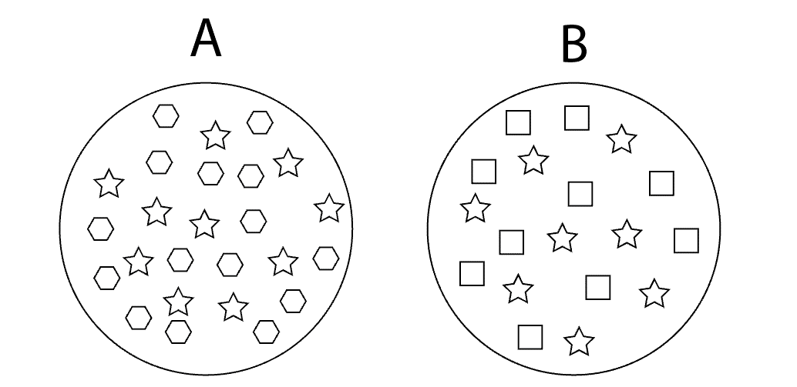

# About
## tl;dr;

  * Concepts have a longer shelf life than whatever specific technology is currently hot.
  * Good instruction should be based on solid instructional principles.
  * This resource is aimed at providing high level conceptual content, not providing in-depth explanations for every technology.

## Overview

One of the greatest challenges we encounter in our knowledge driven society is keeping up with the ever changing face of technology. Specific software tools, languages, and frameworks can change atrelatively quick rates, forcing us to update our skills constantly. This cycle can be particularly vicious as a technology professional since frameworks that are popular today can quickly lose favor tomorrow.

Even though the current hot technology is always in flux, it is worth noting that the underlying concepts of technology are relatively constant. For example, the concept of a programmatic loop has remainedmore or less constant for decades. Though the tags and styles used within html continue to evolve as new features are added, the underlying concept of markup and a style has remained unchanged.

**This website focuses on teaching current technologies framed within the context of these relatively timeless concepts.** There are several reasons for presenting the content this wayincluding the following:

* Frequently when the root concept is examined a more commonly known instance of that concept can be found. By relating the technological instance of the concept to the common instance of the concept it can be significantly easier to understand the first time. For example, many people have experience combining paints to make new colors. With a little bit of coaching most people can be brought to understand how combining paint pigments is similar to combining lights at specific wavelengths to create colors as we do with the RGB color system.
* As you come to understand a core concept it becomes easier to understand other instances of that concept. For example, once an individual understands the idea of a class in one language it becomes significantly easier to grasp classes within another language.
* As you begin to understand multiple instances of a concept it often converts tacit knowledge into explicit knowledge. For example, as a learner comes to understand how the decimal system works conceptually, it becomes obvious why it is considered a base 10 system.
* Conceptual learning is typically pretty interesting. I recognize this is not particularly scholarly and likely demonstrates my personal bias, but I truly get the feeling conceptual learning is usually interesting to people. It is in the details of implementation that we get bored. When we are interested in something we naturally tend to pay attention more, and have a much better chance of learning it.

**Additionally, site attempts to teach current technologies and concepts using solid instructional principals.** There are certainly many approaches to generating instruction, allwith different advantages and disadvantages. The following are the core instructional principles outlining how instruction has been crafted.

* *Demonstrate concepts using multiple instances.* Using multiple instances has two main advantages.
    * First, multiple instances can help the leaner distinguish the essence of a concept from implementation-specific syntax. On an abstract level this can be demonstrated by drawing two circles that each represent an instance of a concept as shown in Figure 1.  Each circle contains multiple shapes some of which represent implementation-specific syntax and others which represent essence of the concept. Either circle in isolation makes it very difficult to determine which internal shapes represent the core concept and which shapes represent implementation-specific syntax. However, add a second circle and it becomes obvious that the star shapes represent the core concepts and all other shapes are merely implementation-specific syntax.
    
