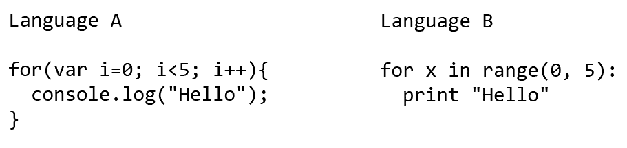

# About
## tl;dr;

  * Concepts have a longer shelf life than whatever specific technology is currently hot.
  * Good instruction should be based on solid instructional principles.
  * This resource is aimed at providing high level conceptual content, not providing in-depth explanations for every technology.

## Overview

One of the greatest challenges we encounter in our knowledge driven society is keeping up with the ever changing face of technology. Specific software tools, languages, and frameworks can change atrelatively quick rates, forcing us to update our skills constantly. This cycle can be particularly vicious as a technology professional since frameworks that are popular today can quickly lose favor tomorrow.

Even though the current hot technology is always in flux, it is worth noting that the underlying concepts of technology are relatively constant. For example, the concept of a programmatic loop has remained more or less constant for decades. Though the tags and styles used within html continue to evolve as new features are added, the underlying concept of markup and a style has remained unchanged.

**This website focuses on teaching current technologies framed within the context of these relatively timeless concepts.** There are several reasons for presenting the content this wayincluding the following:

* Frequently when the root concept is examined a more commonly known instance of that concept can be found. By relating the technological instance of the concept to the common instance of the concept it can be significantly easier to understand the first time. For example, many people have experience combining paints to make new colors. With a little bit of coaching most people can be brought to understand how combining paint pigments is similar to combining lights at specific wavelengths to create colors as we do with the RGB color system.
* As you come to understand a core concept it becomes easier to understand other instances of that concept. For example, once an individual understands the idea of a class in one language it becomes significantly easier to grasp classes within another language.
* As you begin to understand multiple instances of a concept it often converts tacit knowledge into explicit knowledge. For example, as a learner comes to understand how the decimal system works conceptually, it becomes obvious why it is considered a base 10 system.
* Conceptual learning is typically pretty interesting. I recognize this is not particularly scholarly and likely demonstrates my personal bias, but I truly get the feeling conceptual learning is usually interesting to people. It is in the details of implementation that we get bored. When we are interested in something we naturally tend to pay attention more, and have a much better chance of learning it.

**Additionally, this site attempts to teach current technologies and concepts using solid instructional principals.** There are certainly many approaches to generating instruction, allwith different advantages and disadvantages. The following are the core instructional principles outlining how instruction has been crafted.

* *Demonstrate concepts using multiple instances.* Using multiple instances has two main advantages.
  
  First, multiple instances can help the leaner distinguish the essence of a concept from implementation-specific syntax. On an abstract level this can be demonstrated by drawing two circles that each represent an instance of a concept as shown in Figure 1.  Each circle contains multiple shapes some of which represent implementation-specific syntax and others which represent essence of the concept. Either circle in isolation makes it very difficult to determine which internal shapes represent the core concept and which shapes represent implementation-specific syntax. However, add a second circle and it becomes obvious that the star shapes represent the core concepts and all other shapes are merely implementation-specific syntax.
  
  

  
  A more concrete example of this can be seen by looking at two for-loops in different programming languages as shown in Figure 2. When both for-loops are showed side by side commonalities between the two constructs become obvious. For example, both examples have numbers that control the number of iterations. Additionally, it becomes obvious that details such as indenting, braces, and semicolons are linked to the specific programming language and not part of the core concept of a for-loop.
  
  

  
  Second, using multiple instances helps clarify details of each particular instance. Consider two colors as displayed in Figure 3. Most people looking casually at these two colors (provided their screen is calibrated) would have trouble seeing how these two squares are different or even question if they are different. However, when you bring the two colors close together in Figure 4 their slight differences become apparent.
  
  

  
  
  

  
  In a similar way instances of a technology concepts receive greater clarification when compared. For example, Mocha and Jasmine are javascript testing frameworks with many similar features. In the same way the two colored blocks look very similar when separated, each framework looks very similar when you visit their home pages. Just as the nuanced differences between the two green blocks becomes much more clear when they are brought together and compared, so the differences between Mocha and Jasmine are clarified when they are brought together and compared. This can be illustrated in an article such <a href='http://thejsguy.com/2015/01/12/jasmine-vs-mocha-chai-and-sinon.html'>Jasmine vs. Mocha, Chai, and Sinon</a> by David Tang.  Within his article you will find small snippets of code each framework placed next to each other. In this way the subtle differences of each framework are easy to distinguish.    
   
* Provide immediate feedback for to the learner when experimenting with the base concept.* Feedback has been a recognized principle for instruction for many years. Technology tools and languages by their very nature have always been reasonably good at providing feedback to learners. For example, when you write some code and compile it you get some output. When you make a mistake in your code an error occurs. Perhaps the hardest part of providing learners with feedback traditionally has been setting up a development environment. This problem has been largely mitigated by online learning development environments such as codecademy.com, codeavengers.com, to cite but a few. Though we have done well in providing feedback for specific programming languages instruction often lacks this some level of feedback when it comes to the base concept. Specifically, this bullet point deals with providing immediate feedback for the concept, and opposed to only providing feedback for the instance of the concept as typically accomplished with online development environments. An example of providing immediate feedback for a base concept can be demonstrated with the <a target='_blank' href='/legacy/binary.html'>binary widget</a>. It demonstrates the base concept but is also interactive providing immediate feedback to the learner.
  
  * Keep the content as short as reasonably possible.

Finally, it should be noted that this list is not conclusive and may be modified in the future. Additionally, most of these principals have some basis in learning theory, though it is beyond the scope ofthis page to provide details regarding this. References to at least some of these can be found in my <a href='https://dl.dropboxusercontent.com/u/472522/techconcepts/Kevin_Ashton_MS_Project.docx'>master'sproject</a>.

## Scope

The intent of techconcepts.io is not to go in depth on every particular technology. Pluralsight, Lynda.com and a variety of other online resources have a plethora high quality technology specific content.Rather the focus of techconcepts.io provide an understandable, open, and composable resource around the concepts of technology. That being said some course material has been created since the process ofcreating a course provides opportunity to discover concepts, evaluate their relative usefulness to a learner, and consider what contexts particular concepts might be taught in.

## Disclaimer

This resource is of my own making and the views and ideas expressed within it our my own. My instructional theory stems from my experiences as a learner, as teacher, and from general instructional principalsgleaned from my master's program in <a href='http://education.byu.edu/ipt'>Instructional Psychology and Technology</a>. I am a technologist with an interest in education and fully recognize there are fargreater educators and educator theorist than myself and welcome feedback from such. Additionally, I have tried to be as accurate as possible but I do not claim to be a subject expert in all areas of technologyand welcome feedback and corrections in this area as well.

## Feedback

Feel free to contact me directly at kevin.m.ashton@gmail.com
